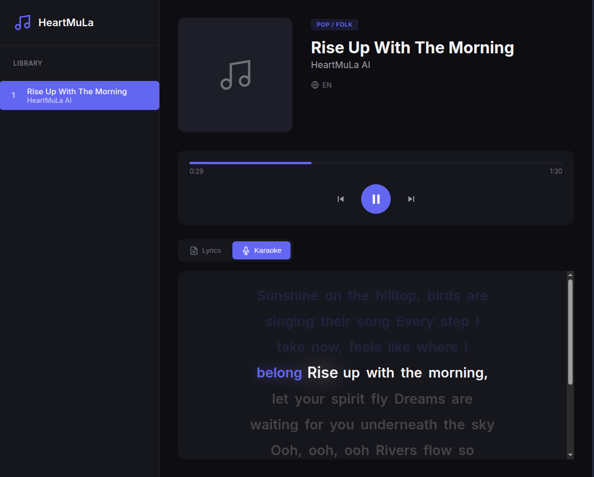

# HeartMuLa Karaoke Player

A folder-based music player with word-by-word karaoke highlighting.



## Quick Start

```bash
cd player
python3 -m http.server 8080
```

Open: `http://localhost:8080/player.html`

> **Note:** Audio files (*.wav) are not included in the repository. 
> Generate songs using the HeartMuLa ComfyUI nodes and copy them to the song folders.

## Folder Structure

Each song lives in its own folder:

```
player/
├── player.html
├── 01_Optimized/
│   ├── audio.wav      # Audio file (required)
│   ├── meta.json      # Song metadata (required)
│   ├── lyrics.txt     # Static lyrics (optional)
│   └── words.json     # Word timestamps for karaoke (optional)
└── 02_MySong/
    └── ...
```

## Adding a New Song

### 1. Create a folder

```bash
mkdir player/02_MySong
```

### 2. Add audio file

Copy your audio file as `audio.wav`:

```bash
cp /path/to/song.wav player/02_MySong/audio.wav
```

### 3. Create meta.json

```json
{
  "title": "My Song Title",
  "artist": "Artist Name",
  "genre": "Genre",
  "language": "EN"
}
```

### 4. Add lyrics (optional)

Create `lyrics.txt` with song lyrics. Use `[Section]` tags for formatting:

```
[Verse]
First line of lyrics
Second line of lyrics

[Chorus]
Chorus lyrics here
```

### 5. Add word timestamps for karaoke (optional)

Create `words.json` with word-level timing:

```json
[
  {"word": "Hello", "start": 0.0, "end": 0.5},
  {"word": "world", "start": 0.5, "end": 1.0}
]
```

**Generate timestamps using HeartMuLa Transcriber:**

In ComfyUI, use the `HeartMuLa_Transcribe` node with:
- `return_timestamps` = `word`
- `output_format` = `json`

### 6. Register the folder

Edit `player.html` and add your folder to the `songFolders` array:

```javascript
const songFolders = [
    '01_Optimized',
    '02_MySong'  // Add here
];
```

## Features

| Feature | Description |
|---------|-------------|
| Lyrics Mode | Static lyrics display with section highlighting |
| Karaoke Mode | Word-by-word highlighting synced to audio |
| Load Timestamps | Paste JSON/LRC timestamps directly in the player |
| Seek | Click progress bar to jump to any position |

## File Formats

### meta.json

| Field | Type | Description |
|-------|------|-------------|
| title | string | Song title |
| artist | string | Artist name |
| genre | string | Genre label |
| language | string | 2-letter code (EN, HI, etc.) |

### words.json

Array of word objects:

| Field | Type | Description |
|-------|------|-------------|
| word | string | The word text |
| start | number | Start time in seconds |
| end | number | End time in seconds |

### Supported Audio Formats

- WAV (recommended)
- MP3
- OGG
- Any format supported by HTML5 audio
